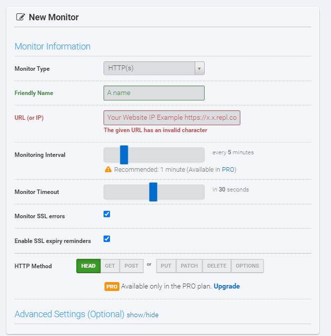

# Discord-Base-Bot
- Simple Discord Bot Using [Discord.JS](https://discord.js.org/#/) V14

# How To Uptime
1) Register / login an account at [UptimeRobot](https://uptimerobot.com/)
2) Go to dashboard, add new monitor.
3) Select All Settings At the image.

    

4) Click Create Monitor.
5) Wait For a few minutes until your monitor **show online**.
6) Your bot is 24/7 now!

# Back to README
[README](../README.md)